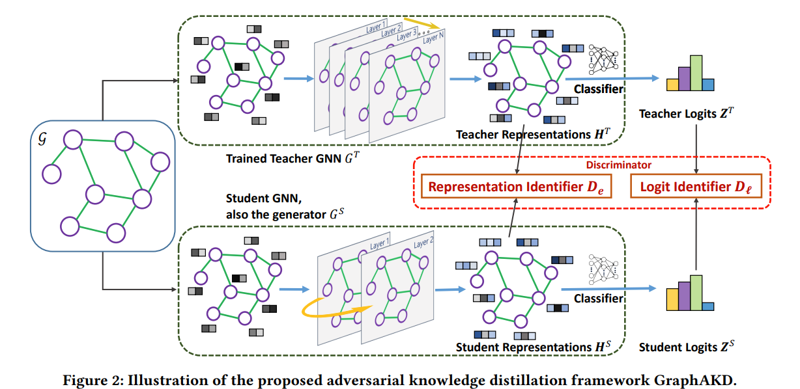

# Graph Adversarial Knowledge Distillation (GAKD)
We use Graph Adversarial Knowledge Distillation (GAKD) to distill the knowledge from the teacher model to the student model. This framework is based on the paper [Compressing Deep Graph Neural Networks via
Adversarial Knowledge Distillation](https://arxiv.org/pdf/2205.11678). Basic idea is to have a discriminator that learns to distinguish between the teacher and student embeddings while the student tries to fool the discriminator.


- We re-implemented the GAKD framework from [GraphGPS](https://github.com/MIRALab-USTC/GraphAKD/tree/main/graph-level) repository with better readability and configurability and used **GINE** model as the student. The official implementation uses **GCN** and **GIN** students.
- Our experiments revolves around **full GAKD training**, and exploration of **Representation Identifier** and **Logits Identifier** effects in isolation.
- All experiments are done on `OGBG-MolPCBA` dataset.

## Setup

- Pre-requisite
    - `GML` Environment setup as described in the root [README.md](../README.md).

1. Create a new directory for the GakD experiments and `logs` directory inside it.
2. Copy [`baseline.py`](./baseline.py), [`gakd.py`](./gakd.py) and `SBATCH` scripts from [`scripts/*`](./scripts/) directory to the new directory.
3. Modify the `SBATCH` script parameters according to your enviornment. Make sure to set the correct `BASE_DIR` (for all experiments) and `TEACHER_KNOWLEDGE_PATH` with the path to the teacher knowledge file (for `gakd` experiments).
4. The output of the experiments will be available in the `$BASE_DIR/results` directory with the name
    - `gine_results_<dataset_name>_<with/without>_virtual_node.csv` for `baseline` experiments.
    - `gine_student_gakd_<dataset_name>_<with/without>_virtual_node_discriminator_logits_<true/false>_discriminator_embeddings_<true/false>_k<discriminator_update_freq>_wd<student_optimizer_weight_decay>_drop<student_dropout>.csv` for `gakd` experiments.
   

## Student Baseline
- We use `GINE` model as the student baseline. The training script for the baseline models is `baseline.py`. 
- We used `Atom` and `Bond` Encoders for encoding node and bond features.
- We trained the baseline with and without `Virtual Node Aggregation`.
- The rest of the parameters are same for both experiments:
    - Number of runs: `5`
    - Starting seed: `42`
    - Dataset: `ogbg-molpcba`
    - Number of layers: `5`
    - Hidden dimension: `400`
    - Dropout: `0.5`
    - Learning rate: `0.001`
    - Batch size: `32`
    - Epochs: `100`
- Our training results for `With Virtual Node Aggregation (Parameters: 12585067)` experiment are summarized in following table:
    | Seed | Valid AP   | Test AP    |
    |-----|------------|------------|
    | 42  | 0.214   | 0.214   |
    | 43  | 0.202   | 0.198   |
    | 44  | 0.219   | 0.213   |
    | 45  | 0.195   | 0.187   |
    | 46  | 0.202   | 0.192  |
    | Mean ± Std | 0.206 ± 0.009 | 0.201 ± 0.010 |
- `Without Virtual Node Aggregation (Parameters: 3717733)` experiment results are summarized in following table:
    | Seed | Valid AP   | Test AP    |
    |-----|------------|------------|
    | 42  | 0.207   | 0.205   |
    | 43  | 0.210   | 0.203   |
    | 44  | 0.209   | 0.206   |
    | 45  | 0.201   | 0.202   |
    | **46*** | **0.208**   | **0.206**   |
    | **Mean ± Std** | **0.207 ± 0.003** | **0.205 ± 0.002** |
- We can see that the `Virtual Node Aggregation` does not improve the performance of the student model on average.
- On the basis of average performance, we selected the models without the `Virtual Node Aggregation` as the baseline model. 
- The best performing model on `Test AP` in that class is with seed `46` (AP: `0.208`). We will consider this model as the baseline model for the rest of the experiments.
    #### Training Baseline Models
    ```
    # with Virtual Node Aggregation
    sbatch scripts/gine-baseline-vn.sh

    # without Virtual Node Aggregation
    sbatch scripts/gine-baseline.sh
    ```

## GAKD Experiments
### Implementation Highlights
We have some notable implementation differences compared to the original implementation:
- We use `GINE` model as the student model.
- Our teacher model is based on `GraphGPS` model configuration for `OGBG-MolPCBA` dataset.
- Their implementation which uses `GCN` and `GIN` students has a very large `Embedding dimension (1024)`, whereas we use `400` for `GINE`.
- Their batch size for `OGBG-MolPCBA` dataset is `512`, whereas we use `32` because of GPU memory constraints. 
- Their default discriminator update frequency (`K` in paper, `Section C.1`) is `1` (update on each iteration), whereas we use `5` (update every 5 iterations) for `OGBG-MolPCBA` dataset. They did not mention the reason for this choice and `K=5` performed better as compared to `K=1` for our initial experiments.
- We execute `2 runs` for most experiments having `50` epochs. For an experiment having `100` epochs, we execute `1 run` due to time constraints. So for single run experiments, we cannot get an estimate of the `standard deviation` for the results.

### Experiment #1: GAKD full without Virtual Node Aggregation
- We did two experiments on full GAKD, one with `50` epochs with `2 runs` and one with `100` epochs with a single run.
- The parameters for students are the same as the baseline model.
- The parameters for discriminators are:
    - Learning rate: `0.01`
    - Weight decay: `0.0005`
    - Discriminator update frequency (K): `5`
- The results are summarized in following table:
    | Seed | Runs | Epochs | Valid AP   | Test AP    | Training Time |
    |-----|------------|------------|------------|------------|------------|
    | 42  | 2 | 50 | 0.213   | 0.2131   | ≈26 hours |
    | **42***  | **1** | **100** | **0.219**   | **0.219**   | **≈26 hours** |
- We can see that the performance of the student model on `Test AP` is best with `100` epochs as compared to student baseline. 
- Under the `50` epochs, the performance gain is a little less as compared to `100` epochs but still better than student baseline.
- This applies that the student model is able to learn more from the teacher model.
- With lesser epochs (i.e. `50`), we still can beat the baseline performance by small margin.
- Ideally, GAN needs larger batch size and more epochs to converge. Here, we are using `32` batch size and `50` epochs due to memory and time constraints, and still we achieve better performance than student baseline.
- Further experiments with larger batch size and more epochs can provide a clearer picture of the performance of the GAKD framework.
- To reproduce the results, submit the following commands via `sbatch`:
    ```
    # 50 epochs
    sbatch scripts/gine-gakd-k5-wd0-drop0.5-epoch50.sh

    # 100 epochs
    sbatch scripts/gine-gakd-k5-wd0-drop0.5-epoch100.sh
    ```

### Experiment #2: GAKD with Representation Identifier
- We did one experiment with `50` epoch where we only trained the `Representation Identifier` discriminators.
- The parameters for discriminators are:
    - Learning rate: `0.01`
    - Weight decay: `0.0005`
    - Discriminator update frequency (K): `5`
- The results are summarized in following table:
    | Seed | Runs | Epochs | Valid AP   | Test AP    | Training Time |
    |-----|------------|------------|------------|------------|------------|
    | **42**  | **2** | **50** | **0.215**   | **0.214**  | **≈13 hours** |
 - Above results indicate that we can achieve similar or better performance than student baseline just by training the `Representation Identifier` discriminators.
 - This contradicts the results of the paper where they mention that both Identifiers are required to achieve better performance.
 - In our case, we achieve better `test AP` performance than student baseline as well as `full GAKD` training just by training the `Representation Identifier` discriminators under `50` epochs. 
 - However, the limitation of only a single training run with `50` epochs makes it difficult to get a good estimate of the mean performance and we cannot say with confidence that `Representation Identifier` discriminators are better than `full GAKD` training in our scenario.
- To reproduce the results, submit the following command via `sbatch`:
    ```
    sbatch scripts/gine-gakd-embeddings-k5-wd0-drop0.5-epoch50.sh
    ```

### Experiment #3: GAKD with Logits Identifier
- We did one experiment with `50` epoch where we only trained the `Logits Identifier` discriminators.
- The parameters for discriminators are:
    - Learning rate: `0.01`
    - Weight decay: `0.0005`
    - Discriminator update frequency (K): `5`
- The results are summarized in following table:
    | Seed | Runs | Epochs | Valid AP   | Test AP    | Training Time |
    |-----|------------|------------|------------|------------|------------|
    | **42**  | **2** | **50** | **0.207**   | **0.205**   | **≈13 hours** |
- Similar to `Experiment #2`, we can not achieve similar orbetter performance than student baseline just by training the `Logits Identifier` discriminators.
- This concludes that we need to train both `Representation Identifier` and `Logits Identifier` discriminators of GAKD framework to achieve better performance.
- To reproduce the results, submit the following command via `sbatch`:
    ```
    sbatch scripts/gine-gakd-logits-k5-wd0-drop0.5-epoch50.sh
    ```

### Experiment #4: Increased Discriminator Update Frequency (K=1)
- We did one experiment with `50` epochs where we trained full GAKD with increased discriminator update frequency (K=1). 
- We wanted to see if the performance of the student model is enhanced by training the discriminators more frequently.
- The parameters for discriminators are:
    - Learning rate: `0.01`
    - Weight decay: `0.0005`
    - Discriminator update frequency (K): `1`
- The results are summarized in following table:
    | Seed | Runs | Epochs | Valid AP   | Test AP    | Training Time |
    |-----|------------|------------|------------|------------|------------|
    | **42**  | **1** | **50** | **0.1382**   | **0.1412**   | **≈13 hours** |
- Above results indicate that frequently updating the discriminators penalizes the performance and we cannot reach the performance of student baseline.
- This highlights that we need to train the discriminators less frequently to achieve better performance. Further experiments are needed to find the optimal discriminator update frequency.
- To reproduce the results, submit the following command via `sbatch`:
    ```
    sbatch scripts/gine-gakd-k1-wd0.00001-drop0.5-epoch50.sh
    ```

## Learnings
- We are able to achieve better performance than student baseline with full GAKD training.
- `Representation Identifier` and `Logits Identifier` discriminators are potentially able to provide better performance than student baseline as well as `full GAKD` training when trained in isolation.
- We need to train the discriminators less frequently to achieve better performance (`K > 1)`.

## Limitations and Future Work
- We did not get an estimate of the `standard deviation` for some experiments due to time constraints. In future, we should run experiments with more runs and epochs to get a better estimate of the `mean` performance and `standard deviation`.
- We need to explore more on the optimal discriminator update frequency (`K`).
- We can try with larger batch size aligning with the original implementation.
- We can also run experiments with `GINE with Virtual Node Aggregation` to see if adding virtual nodes helps in achieving better performance under GAKD framework.
