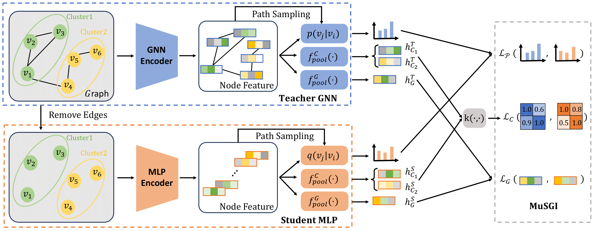

# MuGSI: Distilling GNNs with Multi-Granularity Structural Information for Graph Classification

We use a multi-granular approach proposed in the paper to distill knowledge from the teacher model to the student model. We do this by adapting [their code](https://github.com/tianyao-aka/MuGSI) and using our GPS teacher while varying the Student models.


- Our experiments here revolve around different student models and their ability to learn .
- MLP plain, MLP+LapPE, GA_MLP (graph augmented mlp) with one-hop neighbours
- All experiments are done on `OGBG-MolPCBA` dataset.

## Setup

- Pre-requisite
  - `GML` Environment setup as described in the root [README.md](../README.md).

1. Create a new directory for the GakD experiments and `logs` directory inside it.
2. Copy [`baseline.py`](./baseline.py), [`gakd.py`](./gakd.py) and `SBATCH` scripts from [`scripts/*`](./scripts/) directory to the new directory.
3. Modify the `SBATCH` script parameters according to your enviornment. Make sure to set the correct `BASE_DIR` (for all experiments) and `TEACHER_KNOWLEDGE_PATH` with the path to the teacher knowledge file (for `gakd` experiments).
4. The output of the experiments will be available in the `$BASE_DIR/results` directory with the name
   - `gine_results_<dataset_name>_<with/without>_virtual_node.csv` for `baseline` experiments.
   - `gine_student_gakd_<dataset_name>_<with/without>_virtual_node_discriminator_logits_<true/false>_discriminator_embeddings_<true/false>_k<discriminator_update_freq>_wd<student_optimizer_weight_decay>_drop<student_dropout>.csv` for `gakd` experiments.

## Experiments

In our experiments for MuGSI, we use variants of the simple MLP student while keeping the same teacher.

We use the following default configuration and mention the change in the particular experiment:

- Number of runs: `5`
- Starting seed: `42`
- Number of layers: `5`
- Hidden dimension: `400`
- Dropout: `0.5`
- Learning rate: `0.001`
- Batch size: `32`
- Epochs: `100`

### Experiment #1: MLP

- We trained a simple MLP with the following configuration. This is same for all student models except when explicitly mentioned:
  - Number of runs: `5`
  - Starting seed: `42`
  - Number of layers: `5`
  - Hidden dimension: `400`
  - Dropout: `0.5`
  - Learning rate: `0.001`
  - Batch size: `32`
  - Epochs: `100`
- We wanted to see the raw performance of the simplest student model possible.
- The results are summarized in following table:
  | Seed | Runs | Epochs | Valid AP | Test AP | Training Time |
  |-----|------------|------------|------------|------------|------------|
  | 42 | 1 | 50 | 0.1382 | 0.1412 | ≈13 hours |
- The baseline for the simplest MLP is reasonable high indicating that the molecular tasks are very determined by the types of nodes present.
- This points us to infer that node features may play a more important role and node feature augmentation should provide better results.
- To reproduce the results, submit the following command via `sbatch`:
  ```
  sbatch scripts/gine-gakd-k1-wd0.00001-drop0.5-epoch50.sh
  ```

### Experiment #2: MLP+LapPE

- We trained a simple MLP with the following configuration. This is same for all student models except when explicitly mentioned:
  - Number of runs: `5`
  - Starting seed: `42`
  - Number of layers: `5`
  - Hidden dimension: `400`
  - Dropout: `0.5`
  - Learning rate: `0.001`
  - Batch size: `32`
  - Epochs: `100`
- We wanted to see the raw performance of the simplest student model possible.
- The results are summarized in following table:
  | Seed | Runs | Epochs | Valid AP | Test AP | Training Time |
  |-----|------------|------------|------------|------------|------------|
  | 42 | 1 | 50 | 0.1382 | 0.1412 | ≈13 hours |
- The baseline for the simplest MLP is reasonable high indicating that the molecular tasks are very determined by the types of nodes present.
- This points us to infer that node features may play a more important role and node feature augmentation should provide better results.
- To reproduce the results, submit the following command via `sbatch`:
  ```
  sbatch scripts/gine-gakd-k1-wd0.00001-drop0.5-epoch50.sh
  ```

### Experiment #2: GA_MLP

- We trained a simple MLP with the following configuration. This is same for all student models except when explicitly mentioned:
  - Number of runs: `5`
  - Starting seed: `42`
  - Number of layers: `5`
  - Hidden dimension: `400`
  - Dropout: `0.5`
  - Learning rate: `0.001`
  - Batch size: `32`
  - Epochs: `100`
- We wanted to see the raw performance of the simplest student model possible.
- The results are summarized in following table:
  | Seed | Runs | Epochs | Valid AP | Test AP | Training Time |
  |-----|------------|------------|------------|------------|------------|
  | 42 | 1 | 50 | 0.1382 | 0.1412 | ≈13 hours |
- The baseline for the simplest MLP is reasonable high indicating that the molecular tasks are very determined by the types of nodes present.
- This points us to infer that node features may play a more important role and node feature augmentation should provide better results.
- To reproduce the results, submit the following command via `sbatch`:
  ```
  sbatch scripts/gine-gakd-k1-wd0.00001-drop0.5-epoch50.sh
  ```

### Training Highlights

We have some notable training differences compared to the original implementation:

- We use `GINE` model as the student model.
- Our teacher model is based on `GraphGPS` model configuration for `OGBG-MolPCBA` dataset.
- Their implementation which uses `GCN` and `GIN` students has a very large `Embedding dimension (1024)`, whereas we use `400` for `GINE`.
- Their batch size for `OGBG-MolPCBA` dataset is `512`, whereas we use `32` because of GPU memory constraints.
- Their default discriminator update frequency (`K` in paper, `Section C.1`) is `1` (update on each iteration), whereas we use `5` (update every 5 iterations) for `OGBG-MolPCBA` dataset. They did not mention the reason for this choice and `K=5` performed better as compared to `K=1` for our initial experiments.
- We execute `2 runs` for most experiments having `50` epochs. For an experiment having `100` epochs, we execute `1 run` due to time constraints. So for single run experiments, we cannot get an estimate of the `standard deviation` for the results.

## Learnings

- We are able to achieve better performance than student baseline with **full GAKD training**.
- However, the performance gain is not as high as the paper suggests. This could be due to the differences in the implementation and training environment (**batch size, embedding dimension, epochs, etc.**).
- **Representation Identifier** and **Logits Identifier** discriminators only achieve a small performance gain over student baseline when trained in isolation.
- We need to train the discriminators less frequently to achieve better performance (`K > 1`).

## Limitations and Future Work

- We did not get an estimate of the `standard deviation` for some experiments due to time constraints. In future, we should run experiments with more runs and epochs to get a better estimate of **GAKD framework** performance.
- We need to explore more on the **optimal discriminator update frequency (`K`)**.
- We can try with **larger batch size** aligning with the original implementation.
- We can also run experiments with `GINE with Virtual Node Aggregation` to see if adding virtual nodes helps in achieving better performance under **GAKD framework**.
- Current training time is exceptionally high and debugging is required to find the bottleneck.
- We can do **tSNE** plots of baseline, student and teacher embeddings and compare the **Silhouette scores** to see if the student embeddings are able to capture the teacher embeddings.
