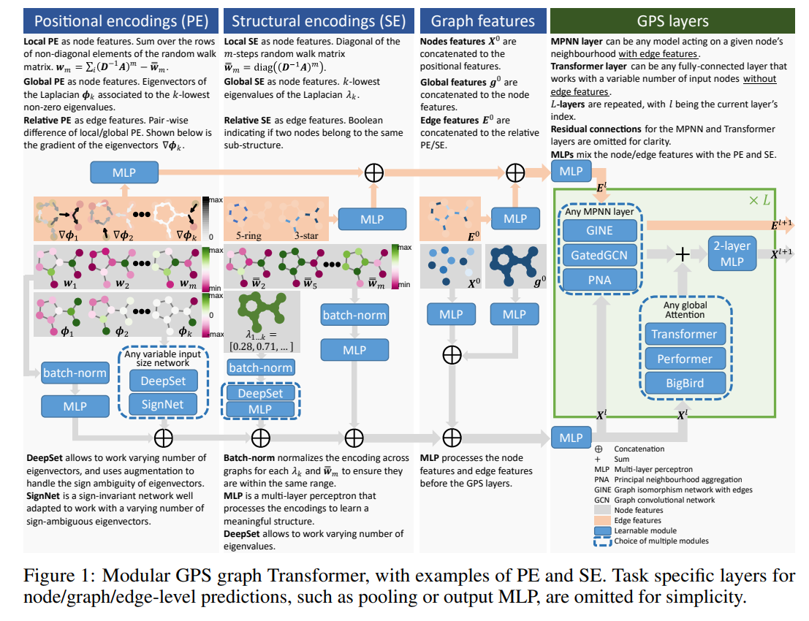
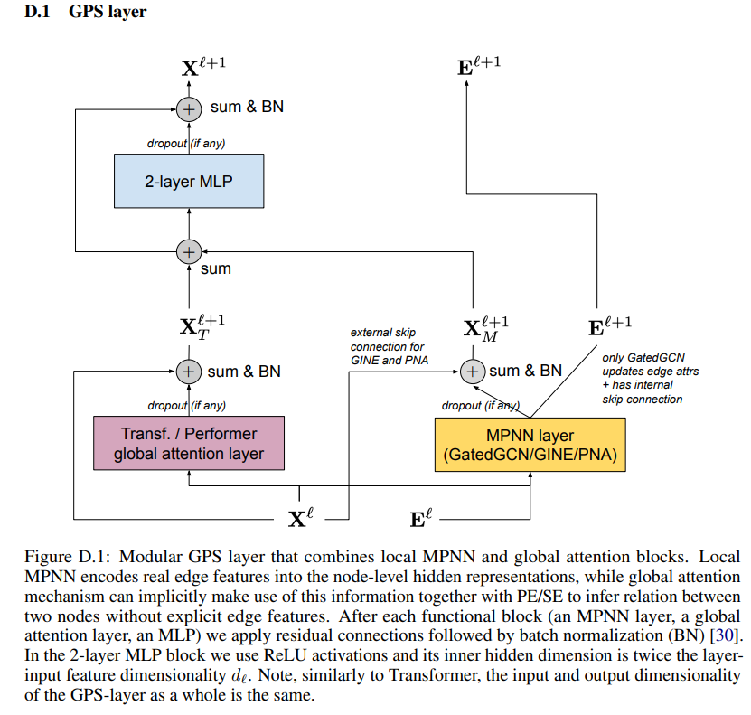

## Teacher using GraphGPS
We used the [GraphGPS](https://github.com/rampasek/GraphGPS) framework to train the teacher model. The overall GraphGPS framework is described in the [GraphGPS paper](https://arxiv.org/abs/2205.12454). The idea behind GraphGPS is depicted in following figure:



The paper introduced a novel GPS Layer having the following computation graph:



### Our Model Configurations 
We adapted the config from the [GraphGPS](https://github.com/rampasek/GraphGPS/blob/main/configs/GPS/ogbg-molpcba-GPS%2BRWSE.yaml) paper experiment on `OGBG-MolPCBA` dataset.
- Node Encoder: `AtomEncoder` + `Random Walk Structure Encoder`
- Edge Encoder: `BondEncoder`
- GPS Layer: `GatedGCN MPNN`  + `Transformer`
- Number of Layers: `5`
- Embedding Dimension: `400` (Changed from `384`)
- Epochs: `100`
- Number of Parameters: `10567020`
- The detailed model architecture can be found in `architecture.text` file.

 
### Setup

  - Pre-requisite
    - `GML` Environment setup as described in the root [README.md](../README.md).

1. Clone the GraphGPS repository 
    ```bash
    git clone https://github.com/rampasek/GraphGPS.git
    ```

2. Change following files to support Embedding and Logits extraction for downstream tasks:
 - Move [`config_embedding.py`](./config_embedding.py) to `GraphGPS/graphgps/config` directory. This file contains the configuration for the embedding extraction script.
 - Replace `GraphGPS/graphgps/loader/master_loader.py` with [`master_loader.py`](./master_loader.py) from current directory. This file adds the logic to add Graph IDs and Node IDs to the `OGBG` datasets during the dataloading process. 
    ```
    # Transform to add Graph IDs and Node IDs to the dataset
    class AddGraphIdTransform:
        def __init__(self):
            self.graph_id = 0
            self.node_count = 0

        def __call__(self, data):
            data.graph_id = self.graph_id
            self.graph_id += 1
            data.node_idx = torch.tensor(
                [i + self.node_count for i in range(data.num_nodes)]
            )
            self.node_count += data.num_nodes
            return data
    ```
3. Copy [`embedding.py`](./embedding.py), [`merge.py`](./merge.py), [`train_config.yaml`](./train_config.yaml), [`scripts/*`](./scripts/) and [`embedding_config.yaml`](./embedding_config.yaml) to `GraphGPS/` directory.
4. Create new directories called `teacher_results` and `logs` in `GraphGPS/` directory to store the results of the teacher model and embeddings.
5. Change the `BASE_DIR` and `SBATCH` configurations  in `scripts/train.sh` and `scripts/embeddings.sh` and copy them to the `GraphGPS/` directory.


### Training the Teacher Model

- Submit the `scripts/train.sh` script to train the teacher model using `sbatch scripts/train.sh`. It will approximately take `18` hours to complete.
- The script will run the training 3 times with seed `42`, `43`, and `44`. The results for each seed will be stored in `teacher_results/<SEED>` directory.
- You can find the best performing model by looking at the `teacher_results/<SEED>/test/stats.json` file.
- For our run, the best performing model was obtained with seed `44`.
- The summary of our experiment is given in following table:

| Seed | Valid Accuracy | Valid AUC | Valid AP | Test Accuracy | Test AUC | Test AP |
|------|---------------|-----------|---------|---------------|-----------|---------|
| 42   | 0.980          | 0.866      | 0.296   | 0.978          | 0.857      | 0.283    |
| 43   | 0.981          | 0.866      | 0.296    | 0.979          | 0.860      | 0.282    |
| **44***   | **0.981**          | **0.873**     | **0.307**    | **0.980**          | **0.870**      | **0.291**    |
| Mean ± Std | 0.981 ± 0.001 | 0.868 ± 0.004 |  0.300 ± 0.006 | 0.979 ± 0.001 | 0.862 ± 0.007 | 0.285 ± 0.005 |
- For embedding extraction, we used the best performing model with seed `44`.

### Extracting Embeddings

1. Update the `embeddings.sh` script `line #16` with the best performing seed.
2. Submit the `embeddings.sh` script to extract the embeddings. It will approximately take `1.5` hours to complete.
3. You can find the embeddings in `teacher_results/teacher-knowledge.pt` file. This file contains a dictionary which can be loaded using `torch.load` function.

### Loading the Embeddings

- The embeddings can be loaded using the following code:
    ```python
    import torch
    embeddings = torch.load("teacher_results/teacher-knowledge.pt")
    ```
- The embeddings are stored in the following format:
    ```
    embeddings['h-embeddings']: (num_nodes_dataset, embedding_dim) # Node embeddings 
    embeddings['logits']: (num_graphs, embedding_dim) # Logits embeddings for each graph
    embeddings['g-embeddings']: (num_graphs, embedding_dim) # Mean of node embeddings for each graph, (for GaKD)
    embeddings['ptr']: (num_graphs + 1) # Cumulative pointer of the nodes in each graph
    ```
- These embeddings are used for downstream knowledge distillation tasks.
- Our teacher knowledge on `OGBG-MolPCBA` dataset can be downloaded from [here](https://drive.google.com/file/d/1BHELWyQiAEWxcwOE0WsPrkK3N7xewSpW/view?usp=sharing).